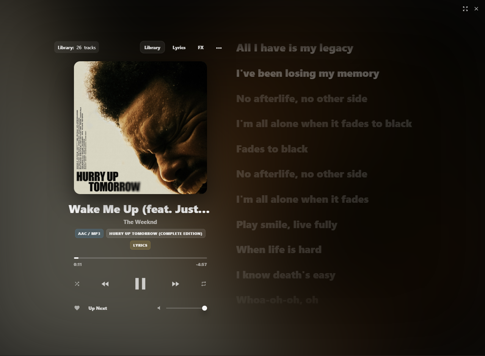

# CloudE-ES-Audio-Player
The First Beta Of Standalone Version Of Cloude Self Hosting Cloud Drive's Audio Player With CloudE Environment System Audio Tuning.

# 🎧 CloudE ES Audio Player

A premium **Apple Music inspired** web-based audio player with smooth UI/UX, lyrics support, crossfade playback, and CloudE Environment Sound™ effects.

> Built for a **Cloude self-hosted cloud drive / music streaming** experience.

---

## ✨ Highlights
- ✅ Premium modern UI (Apple Music inspired)
- ✅ Smooth playback experience
- ✅ Crossfade transitions
- ✅ Lyrics support (LRCLIB)
- ✅ Favorites + queue system [Still In Progress]
- ✅ CloudE Environment Sound™ (FX Panel)
- ✅ Fully responsive (Mobile + Desktop) [Still In Progress]
- ✅ Works without backend (Frontend-only) 

---

## 🖼️ Preview
> UI / UX previews (design assets)

---

## 🚀 Run Locally

Open `index.html` in browser.

### Option 2: Recommended (Local Server)
Using VS Code:
1. Install **Live Server**
2. Right-click `index.html`
3. **Open with Live Server**
